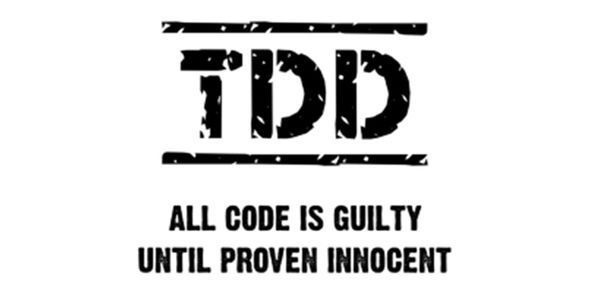
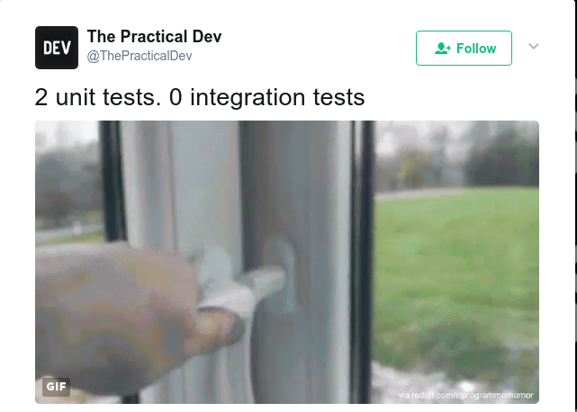
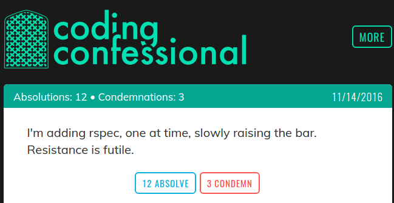

## TDD



---

## Why test?

> "Everyone has a test environment. Some of us are lucky enough to have a separated production environment"

> @stahnma

---

### Why test?

- We make mistakes
- (a lot of them)
- Either we found them... or the customer does

---

## Manual testing

* Good for exploration/UX
* Totally fine generally
* Test scripts are powerful tools

---

### Scripts

- Go to the main
- Login with "admin" (should show a list of customers)
- Click on the first customer (should show detail)
- Add a note on it (should redirect to the detail, with the note)

If you start testing regularly, note your testing scheme.

---

### Scripts - Why?

- Can share
- Ensure everyone tests the same things
- Avoid forgetting important parts
- Speed

---

### Scripts - Personal experience

I used to write down my "sanity test" for a previous company. I could run it in 6-7 minutes. Even once a day, it was not costing me any real time.

Tip: put that in a TEST.md file in your repo, update when updating the code.

---

## Why automate tests?

* Consistency
* Avoid side effects
* Productivity
* Safety net

---

## Why automate tests?

Most of the time, the new feature you are working on will work...

... it will break something else

---

## Also...

It put you directly in the shoes of the person using the code, instead of writing it.

---

## Automated testing

* Systematic
* Consistent

---

## Principle

Use known input and output value to validate that the code is doing what it should.

* Initial values
* Method under test
* Assertion!

---

## Unit Test 101

---

## Simplest example

```ruby
require 'minitest/autorun'

class GameTest < Minitest::Test
  def test_the_truth
    assert true
  end
end
```

---

## Run

```bash
➜  v1 ruby test/game_test.rb
Run options: --seed 19942

# Running:

.

Finished in 0.001065s, 938.7247 runs/s, 938.7247 assertions/s.

1 runs, 1 assertions, 0 failures, 0 errors, 0 skips
```

---

### Simple start

* Expect (good) results
* "Happy case"

---

### Expecting the unexpected

* Expect an exception
* People make mistakes

---

### Assertions

```ruby
require 'minitest/autorun'

def add(a, b)
  a + b
end

class NumberTest < Minitest::Test
  def test_add_integers
    assert_equal 4, add(2,2)
  end
end
```

---

### Assertions

No assertions means your test is:

"Does this code fail in a spectacular way" - not a really interesting question

---

### Errors vs Failures

Failure: the code did run, but an assertion did fail
Error: the code failed

---

## A bigger example

Devise - the kind of software we depend on

```bash
git clone git@github.com:plataformatec/devise.git
cd devise
bundle install
rake

=> 17 seconds for 2171 assertions
```

---

## Some definitions

---

### Unit tests vs Integration tests



---

### Unit tests vs Integration tests

Unit Test:

* Small unit of functionality
* No outside impact
* Fast
---

### Unit tests vs Integration tests

Integration Test:

* End to End functionality
* Slow / Brittle

---
### Test Pyramid


---

### TDD vs BDD

* Test driven version Behaviour driven
* About the results vs about the features
* BDD usually "read like sentences"

---

### TDD vs BDD

```ruby
# TDD (MiniTest)
def test_order
  assert @customer.orders.include? @order
  assert @customer.ordered_book.include? @book
end

# BDD (RSpec)
it "puts the ordered book in customer's order history" do
  expect(@customer.orders).to include(@order)
  expect(@customer.ordered_books).to include(@book)
end
```

---

### TDD vs BDD

Pick one, you should be fine

---

### TDD vs Test First

---

## Lifecycle

---

### A "simple" chart

From  @sarahmei


---

### TDD

* Write the test
* Run (it fails!)
* Write the minimal amount of code needed to make the test green
* Repeat

"Baby steps"

---

### Why?

* Force you to think about how to use your code
* Prevent you to write any code you don't need
* Small increment make it very easy to spot bugs

---

### Baby steps

Spotting errors is easy in 3 lines of code - less so in 2000

---

### "Red, Green, Refactor"


---

### "Red, Green, Refactor"

Don't clear/refactor non working code - fix it first, refactor after (keeping it working of course)

---

### Test as bug fixing technique

* Reproduce the bug
* Create a test on it (it fail)
* Fix the bug
* Run the test

---

### A TicTacToe game

- 2 players, 'X' and 'O'
- 'O' starts
- Players alternate putting a piece
- 3 x 3 board
- First player with three aligned pieces wins

---

### Design

* A simple 'Game' class to get started
* That's all

---

## Let's try

LIVE CODE TIME!

---

## Some confessions

* I don't aim for 100% test coverage
* Most of my prototypes are untested

---

## From the trenches

* Manual (scripted!) testing can be very efficient
* Test costs - creation & maintenance
* UI are notoriously hard to test (ex: change a button "exit" to a menu - the user is fine, the test is broken)

---

## From the trenches

> I don't have time to test!

* What feels faster? A skateboard or a 747? What goes faster?
* You'll use the time - writing tests or debugging it. Pick one.

---

### Testing value

* If it’s hard to read… it’s hard to test.
* If it’s hard to test… it’s hard to use.
* If it’s hard to test… you’re probably doing it wrong.
* If it’s hard to test… take a look at the design and test it again !

---

## Tests in the way

If you want to have & maintain tests:

* They should break the build
* They should run fast
- Tests should be part of the review (we reject PR without tests)

It's still a team effort & decision - make it part of your "DoD"

---

## Final words



---

## A first step

* A single test is better than no test
* Start where it hurts
  - code that change a lot
  - code that breaks a lot
  - code easy to test
  - last bug

---

## About me

I'm Martin

I've been creating bugs in Healthcare to Finance & in one person company to multinationals since 15 years

I'm a coach at LeWagon

I'm currently CTO at BLSQ

You can reach me at martin@joyouscoding.com

---

# THANKS!

[https://gitpitch.com/vanakenm/tdd-workshop](https://gitpitch.com/vanakenm/tdd-workshop)
